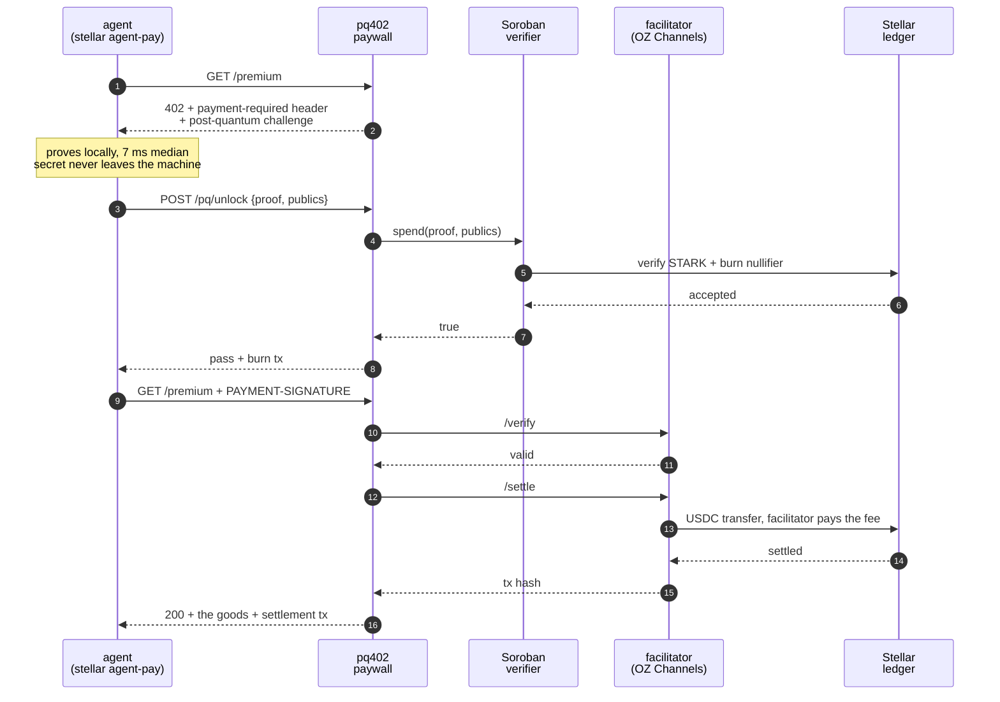
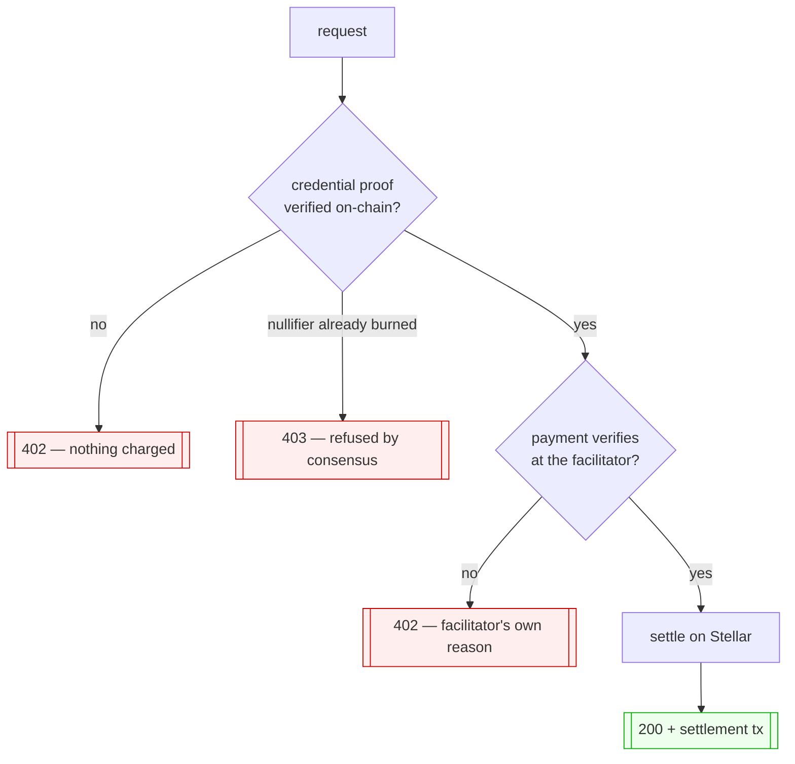

# pq402

**An API that charges an AI agent, checks it is allowed to buy, and never
learns which buyer it was.**

Stellar Summit SP 2026 · Payments and Agent Tooling (SDF DevEx) ·
sub-lane 3A, Agentic Payments (x402 / MPP)


**[Read the paper](paper/pq402.pdf)** — seven pages on what the server learns,
the four undocumented details of x402 on Stellar, and every claim with its
transaction hash.

---

## The part we have not seen done before

Every agentic-payment demo answers one question: *did the agent pay?* Metered
APIs have a second one — *is this agent allowed to buy this at all?* — and the
usual answers, an API key or an account, stamp the buyer's identity onto every
request they ever make.

This answers both, and answers the second **without learning who is asking**.

```json
{ "premium": "paid for by a member of the set, and the set is all this server knows" }
```

That response is not a slogan; it is the literal ceiling of what the server
knows. The credential proof publishes a commitment

```
C = compress(leaf ‖ blinder)        fresh blinder every use, leaf never
```

and two proofs compose on that shared `C`: one proves a member acted and burns
a nullifier so it cannot act twice, the other proves `C` sits under the
issuer's published root through a **private** authentication path. The server
sees that someone in the set paid. It cannot tell which member, and it cannot
link two payments by the same credential to each other, because no public value
survives from one use to the next.

Both verdicts come from Soroban contracts, not from the server, and the
challenge is not the server's to choose either: the acting contract derives the
expected round from the **ledger sequence** and refuses anything else.

**One command, from nothing to an anonymous purchase:**

```bash
./demo-crowd.sh
```

```
1. the challenge comes from the ledger, not from us
   round 9b150000...  (ledger_sequence / 720, refused if stale)
2. the issuer admits a member: one credential, one root
   commitment C 54755715...   (fresh blinder; the leaf appears nowhere)
3. the API starts, knowing only the root
   listening on :4800 — it holds a root, and no list of members
4. the agent proves membership and that it acted, and pays
   membership verified, nullifier burned by consensus
   .../tx/8ce1969938bd111e511b8a3e159274c71139d47f701d6dbd7f5bf775c33d37b5
   200 unlocked
   {"premium":"paid for by a member of the set, and the set is all this server knows",
    "settled_by":"f6308c862154bb9c91cccfd57b85298388d8e799a9f3b338b0193d59978e8b55"}
```

Run it twice inside the same hour and the second is refused — by the contract,
not by the script. That refusal is the single-use guarantee showing its face.

Live on testnet, [`examples/crowd-app`](examples/crowd-app):

| | transaction |
|---|---|
| credential burned by consensus | [`d87d75d6…`](https://stellar.expert/explorer/testnet/tx/d87d75d6aa291b42e37bfdc4d56f8b868bae270d53239bb8dd656aec5f237748) |
| USDC settled, fee paid by the facilitator | [`7b47f7fb…`](https://stellar.expert/explorer/testnet/tx/7b47f7fbd23ad6ed44b667903c66adb634fd721cb49e0f6d0c8606a3172940ec) |

And it is a configuration option, not a fork — one word in the middleware this
repo publishes:

```js
credential: { mode: "crowd", actContract, membershipContract, root, source }
```

**On the claim.** We know of no prior x402 payment gated by an unlinkable
credential, on Stellar or anywhere, and no prior STARK verified directly by a
Soroban contract — everything verifying zero-knowledge proofs on Soroban today
is pairing-based, and RISC Zero reaches Stellar only after a Groth16 wrapper
that reintroduces pairings and a trusted setup at the last step. That is a
statement about what public search surfaced on 2 August 2026, not a proof of
absence. If it is wrong, the correction belongs here and we will put it here.

---

## The ordinary path, for comparison

The same loop with the identifying credential — simpler, one proof, and the
server does learn which credential paid:

```
$ stellar agent-pay http://localhost:4402/premium --max 0.10
→ GET http://localhost:4402/premium
← 402 Payment Required: 0.10 USDC on stellar:testnet → GAWAG7OD…
proving PQ credential (q=40, contract CA6QM6DR…)…
proof: 79186 bytes in 8ms
PQ verified ON-CHAIN by CA6QM6DR… (testnet) → pass granted
nullifier burned by consensus: …/tx/0da1d074c98c7bde272cc179600c785bdf6b01dae…
paying…
← 200 unlocked        settlement 2c8e59290d6f5215cab1840a76433830ad3e3eb8dbc…
```

Both hashes are real and on testnet. [`TRANSCRIPT.md`](TRANSCRIPT.md) has the
full run: two purchases with their own burns and settlements, the recipient
moving from `0.76` to `0.96` USDC, and the network fee paid by the
**facilitator** rather than by the agent.

## On-chain

Two Soroban contracts decide things here. Neither is a mock, and the paywall
can overrule neither.

| contract | address | what it decides |
|---|---|---|
| crowd gate | [`CAEZ25KZ…`](https://stellar.expert/explorer/testnet/contract/CAEZ25KZFMYAL44I342B44VYG5KVO5ESHNDQXC2Y3VSWN5XAN3OQOANO) | did a member act, under a commitment that names nobody — and burns the nullifier. Derives the round from the ledger, so freshness is not the server's to assert |
| membership | [`CDO2NDPR…`](https://stellar.expert/explorer/testnet/contract/CDO2NDPR37AEDFZJTN3MBHMS6QBDQ6Y44YCGPGRIOXHKWPX4L2JPXIWK) | is that commitment under the issuer's root, proved through a private path |
| credential verifier | [`CA6QM6DR…`](https://stellar.expert/explorer/testnet/contract/CA6QM6DRPVYRHFWEWNATDIKLL4P47XBI2OWVL7226WHHOTFEY2W2JKET) | the identifying path: is this a valid, unspent credential — verifies a hash-based STARK and burns the nullifier |
| agent treasury | [`contracts/agent-treasury`](contracts/agent-treasury) | is this payment inside policy — a rolling daily cap and a contract allow-list, refused in consensus |

The treasury's source is in this repo (Rust, `soroban-sdk`). The verifier's is
in [riverrun](https://github.com/Galmanus/mirror-pool/tree/feat/behavioral-pool-provenance-tracer/crates/riverrun-m31),
the Circle-STARK library it was built from — this repo consumes the deployed
contract rather than vendoring a copy of it.

The paywall, the CLI agent and the middleware are JavaScript because that is
where x402 lives: `@x402/fetch` and `@x402/stellar` have no Rust port, and the
sub-lane asks for middleware targeting Express, Hono and FastAPI. What runs
on-chain is Rust; what speaks HTTP is not.

## What this is

Most agent-payment demos answer one question: *did the agent pay?* This one
answers a second that metered APIs actually have: *is this agent allowed to buy
this at all?* — and answers it without learning who the agent is.

Two independent gates on one request:

| gate | mechanism | who decides |
|---|---|---|
| **payment** | x402 `exact` scheme, USDC over its Soroban Asset Contract, settled through the OpenZeppelin Channels facilitator | Stellar consensus |
| **credential** | a hash-based STARK proving the caller holds a valid credential, verified by a Soroban contract, nullifier burned in contract storage | Stellar consensus |

Neither gate trusts the server. The paywall cannot forge a settlement, and it
cannot decide the credential is valid — it forwards a proof to a deployed
contract and reads the verdict. Replay is refused by the chain rather than by
an in-process set, so restarting the server does not reopen a spent credential.
The same proof, spent twice against `CA6QM6DR`:

| | tx | result |
|---|---|---|
| first spend | [`0f722519…`](https://stellar.expert/explorer/testnet/tx/0f722519e12cc030708e0644bc695ea0b9fe6ccc7a03761c1e7338d4f0e20ec0) | `true` |
| literal replay | [`c1a1a971…`](https://stellar.expert/explorer/testnet/tx/c1a1a971c67e84e4d851de6e63b6a6521910b0ec00840ef68be59753a9af4959) | `false` |



Two gates, two independent refusals — and a payment that is never taken for a
credential that would have been rejected:



## Run it

```bash
git clone https://github.com/Galmanus/pq402 && cd pq402
npm install               # the server and setup script
(cd cli && npm install)   # the agent

cp .env.example .env
node setup.mjs            # generates + funds both accounts, writes them to .env
# → fund the payer with USDC and paste a facilitator key, see below

./demo.sh                 # starts the server itself and runs the whole loop
```

`demo.sh` starts its own server, so there is no second terminal to keep in
sync. If the server refuses to start it prints why, rather than letting the
demo fail three steps later about something unrelated.

Four things go in `.env`, and `setup.mjs` fills in three of them:

1. **An OZ Channels testnet key.** A plain GET mints one:
   ```bash
   curl -s https://channels.openzeppelin.com/testnet/gen
   # {"apiKey":"…"}
   ```
   Required on testnet as well as mainnet; every facilitator endpoint answers
   `401` without it, and this server refuses to start rather than advertise a
   paywall it cannot settle.
2. **Testnet USDC for the payer** — [faucet.circle.com](https://faucet.circle.com),
   pick Stellar testnet. This one is captcha-gated and has to be done by hand.
3. A recipient `G...` account with a USDC trustline (`STELLAR_RECIPIENT`).
4. A stellar CLI identity holding that USDC (`PQ_SOURCE`) — the agent signs
   through the keystore, not through a secret in `.env`.

`setup.mjs` does everything scriptable: it generates both keypairs, funds them
with friendbot, adds the USDC trustlines, and writes `STELLAR_RECIPIENT` and
`STELLAR_SECRET_KEY` into your `.env`. What it cannot do is the captcha at the
Circle faucet — it prints the payer address to paste there.

The facilitator key is one command:

```bash
curl -s https://channels.openzeppelin.com/testnet/gen   # → {"apiKey":"…"}
```

To try the credential half with no key and no funded wallet, set
`MOCK_PAYMENT=1`. That stubs **only** the settlement; the proof still goes to
the chain and the nullifier still burns.

## The flow

```
agent → GET /premium
     ← 402  { accepts: [ exact, USDC SAC, amount, payTo ],
              pq_required: { contract, relation, challenge } }

agent   proves the credential locally           7 ms median
agent → POST /pq/unlock  { proof, publics }
server→ Soroban: spend(proof, publics)          verify + burn, one tx
     ← { pass, burn_tx }                        the chain decided

agent → GET /premium  + PAYMENT-SIGNATURE + X-PQ-PASS
server→ facilitator /verify   then   /settle    USDC moves on Stellar
     ← 200 + the goods + settlement tx hash
```

Proving is 7 ms at the median, 6 to 11 across fifteen runs on an ordinary
laptop, process startup included — measured rather than estimated, because a
number in a README is a claim like any other.

Verify precedes settle deliberately: settle moves money, so a payload that
fails verification must never reach it. A refusal returns the facilitator's own
reason rather than a bare `402`.

Four details worth stealing if you build your own — each one cost a debugging
round here:

- **`asset` is the SAC (`C…`), `payTo` is the classic account (`G…`).** The
  scheme invokes `transfer` on the contract; the account is what ends up
  holding the balance, which is also why it needs a trustline.
- **Stellar USDC has seven decimals, not six.** `0.10` is `1000000` base units.
  The EVM habit is a 10× underpayment that settles quietly.
- **v2 puts the requirements in a `payment-required` HEADER, not the body.** The
  body is read only when `x402Version === 1`. A server that publishes perfect
  requirements in JSON alone is invisible to a v2 client, which fails with
  `Invalid payment required response` having never looked at them. Every 402 on
  a gated route needs the header, including the one that says "you have a pass
  but no payment yet".
- **The signed payload comes back in `PAYMENT-SIGNATURE`**, with `X-PAYMENT`
  being the v1 name. Read both.
- **`extra.areFeesSponsored` must be in the requirements**, and it belongs to
  the facilitator. Ask `/supported` at startup and copy what it says rather
  than asserting it yourself.

## Why x402 here

x402 lets the agent hold **zero XLM**. It signs Soroban authorization entries
rather than transaction envelopes; the facilitator assembles the transaction,
pays the fee, and submits. For an autonomous agent that is the difference
between maintaining a funded gas wallet and holding only the asset it intends
to spend.

MPP Charge is the better pick when you would rather not depend on a facilitator
at all — it settles directly through the SAC. The two are complementary; this
repo takes the x402 path because fee sponsorship is what keeps an agent's
wallet simple.

## The reusable part

The protocol work is published as
**[`x402-stellar-paywall`](https://www.npmjs.com/package/x402-stellar-paywall)**,
a one-line paywall middleware for Express and Hono with a Stellar facilitator
preset:

```bash
npm install x402-stellar-paywall            # Express, Hono — on npm
pip install -e packages/x402-stellar-paywall-py[fastapi]   # FastAPI — from this repo
```


```js
const pay = await expressPaywall({ price: "0.10", payTo: process.env.STELLAR_RECIPIENT });
app.get("/weather", pay, (req, res) => res.json({ temp: 24, settled_by: req.x402.transaction }));
```

It encodes the four protocol details above as behaviour rather than as advice,
and it fails at startup — with the command that fixes it — rather than
advertising a price it cannot settle. Offline tests pin the shaping, including
one asserting that a failed verify never reaches settle.

Proven on something other than its birthplace, and from the registry rather
than the working tree: `examples/second-app` is a weather API with no
credential logic anywhere in it, which declares `x402-stellar-paywall` as an
ordinary npm dependency, gates one route with one line, and is paid by the same
agent. Settlement `4bfd5a8f75522b20556803ae84857331059d3c74acf92aa27854108b…`,
with the fee paid by the facilitator.

```bash
cd examples/second-app && npm install && node server.mjs
stellar agent-pay http://localhost:4500/weather --max 0.10 --source pq402-payer
```

And the differentiator is an option, not a fork of the server:
[`examples/gated-app`](examples/gated-app) demands **both** gates in one
configuration — payment settled by a facilitator, credential judged by a
contract — in about twenty lines. It returned
`{"premium":"paid for, and proved eligible, without saying who","settled_by":"dcfed383…"}`.

## Layout

```
server.mjs   the paywall: 402, the PQ challenge, verify-then-settle
booth.mjs    the same flow driven from a browser, for demoing on a screen
demo.sh      one command, end to end
setup.mjs    generates and funds the two testnet accounts
bin/         prover binaries, built from the riverrun-m31 Rust crate
cli/         `stellar agent-pay`, the plugin the agent runs
ui/          the booth's page
packages/    x402-stellar-paywall, the middleware kit (JS and Python)
examples/    crowd-app (anonymous membership), gated-app (both gates),
             second-app (Express), fastapi-app (Python)
contracts/   agent-treasury, the on-chain spending policy
```

## What maps to what

| the sub-lane asks for | here |
|---|---|
| *Agent pays for an API — live 402, pay, unlock loop* | `demo.sh`, four transactions in [`TRANSCRIPT.md`](TRANSCRIPT.md) |
| *working paywall with sponsored gas* | every settlement's fee is paid by the facilitator, visible in the fee account differing from the agent |
| *x402 middleware kit for Express/Hono/FastAPI, published as a reusable package* | [published on npm](https://www.npmjs.com/package/x402-stellar-paywall); the Python twin installs from this repo, PyPI pending. Gates [`examples/second-app`](examples/second-app) (Express) and [`examples/fastapi-app`](examples/fastapi-app) (FastAPI), each paid on testnet |
| *agent treasury with policy signers — inside policy succeeds, outside refused on-chain* | [`contracts/agent-treasury`](contracts/agent-treasury) |
| *(not asked for, and the reason to look)* | a payment whose seller learns set membership and nothing else — [`examples/crowd-app`](examples/crowd-app) |

### The CLI plugin

`cli/` installs as an external `stellar` subcommand, so it composes with the
keys you already manage:

```bash
cd cli && ./install.sh
stellar agent-pay <url> --max 0.10 --source my-key
```

It prints the price before paying, enforces `--max`, refuses to spend in a pipe
without `--yes`, and returns a distinct exit code for each way it can refuse:

| code | meaning |
|---|---|
| `0` | unlocked |
| `2` | usage |
| `3` | price exceeds `--max` |
| `4` | payment or settlement failed |
| `5` | credential missing or refused by the chain |
| `6` | inside the cap, but unconfirmed in a pipe |

`3` and `6` are separate on purpose: a script should stop and alert on the
first and simply re-run with `--yes` on the second.

## Tests

Everything here runs with no facilitator key, no funded wallet, and no network.
What needs money is evidenced by transaction hashes instead.

| suite | what it covers | |
|---|---|---|
| `node --test cli/test/*.mjs` | the agent's pure logic: 402 parsing, `--max`, exit codes, price formatting | 16 |
| `packages/x402-stellar-paywall` — `npm test` | protocol shaping, and that a failed verify never reaches settle | 17 |
| `packages/x402-stellar-paywall-py` — `pytest` | the same, in Python | 9 |
| `contracts/agent-treasury` — `cargo test` | the allow-list, the rolling cap, and that a refusal costs no budget | 4 |

## Honest limits

This section exists because a payments demo that overstates is worth less than
one that under-delivers.

- **The proof lane is never mocked.** The verdict comes from a deployed
  contract and the nullifier burn is a real transaction with an explorer link.
  `MOCK_PAYMENT=1` stubs the settlement only, and when it is on the 402 says so
  in its own body.
- **Post-quantum describes the proof system, not Stellar.** The STARK is
  hash-based and survives Shor. The transaction carrying it is signed with
  Ed25519, which does not. This is a post-quantum component running on a
  pre-quantum chain, and the other half is the network's to supply.
- **Which limitation applies depends on the mode.** In the default mode the
  leaf is a public input, so the server knows which credential paid and two
  payments by one credential are linkable. `mode: "crowd"` removes both: the
  leaf never appears and each use carries a fresh blinder. The cost is a second
  proof and a second transaction, and one credential acting once per hour-long
  epoch rather than once per challenge.
- **The credential relation publishes digests, and that took a fix.** Until
  04/08 it published the full sixteen-limb permutation state for both the leaf
  and the nullifier. Poseidon2 is a bijection and the context sits public
  beside it, so one inversion on published data returned the credential secret
  — demonstrated against a real testnet proof, in milliseconds. Both are now
  truncated to eight limbs, which puts recovery back at `|F|^8 ≈ 2^248`, and
  the verifier here (`CA6QM6DR…`) is built from the repaired relation. The
  provers in `bin/` were rebuilt with it; a mismatched pair fails loudly on the
  public-input length rather than silently.
- **Single use survives a restart, not a redeploy.** The nullifier lives in
  contract storage, so the server can restart freely. Deploying a fresh
  verifier starts a fresh nullifier set.

## Built on

- [x402](https://github.com/coinbase/x402) — `@x402/fetch`, `@x402/stellar`
- [OpenZeppelin Channels](https://channels.openzeppelin.com) as the facilitator
- [Plonky3](https://github.com/Plonky3/Plonky3) for the Circle STARK machinery
- The credential relation and its Soroban verifier come from riverrun

MIT.
