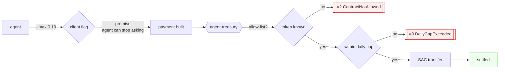

# agent-treasury

**A wallet an autonomous agent pays from, that refuses to break its own rules.**

```
1. INSIDE policy — 0.02 USDC
   tx 50fb38c77a1b9fa3bb74e541c21d27b7eb01a09940079ad52e595b884d745c74
   remaining: 100000

2. OUTSIDE policy — 0.02 more, against a 300000-unit daily cap
   REFUSED by the contract — #3, DailyCapExceeded

3. OUTSIDE policy — a token the treasury was never told about
   REFUSED by the contract — #2, ContractNotAllowed

remaining after both refusals: 100000 — a refusal costs no budget
```

## Promise versus rule

`stellar agent-pay --max 0.10` is a **promise**. The agent is asking itself to
behave, and an agent that has been prompt-injected, misconfigured, or simply
handed a bad tool description stops asking. Nothing outside the agent noticed.

A cap in a contract is a **rule**. The authorization the transfer needs does not
exist unless the transfer is inside policy, so the refusal happens in
consensus. There is no client-side path around it, because the client is not
the one deciding.

Both belong in a real system — the flag saves a round trip, the contract saves
the treasury — and this repo ships both so the difference is visible.



## The two policies

| policy | what it stops |
|---|---|
| **contract allow-list** | a stolen policy key pointed at a token or protocol this treasury was never meant to touch |
| **rolling daily cap** | a compromised agent draining the balance in one session, keyed off ledger time so it cannot be reset by calling more often |

Both are checked on every spend, before any token moves, and a refusal consumes
no budget.

## Two shapes, one rule

The contract implements the policy twice, deliberately.

**`pay(token, to, amount)`** is the front door, and what the demo and the agent
use. It applies the rule and then performs the transfer.

**`__check_auth`** is the same rule as a Soroban **custom account**, which is
the more powerful shape: the policy lives in the *authorization* itself, so it
binds anything the treasury is ever made to sign, including calls this contract
has never heard of. It is not the demo path for an honest reason — using it
requires the caller to hand-assemble a `SorobanAuthorizationEntry`, because
`authorizeEntry` in `@stellar/stellar-sdk` assumes an ed25519 account and calls
`Keypair.fromPublicKey()` on the authorizer, which throws `invalid version
byte` on a `C…` contract address. That is a real gap in the tooling, and
pretending otherwise by shipping a path that does not run would be worse than
saying it.

## Run it

```bash
RECIPIENT=G...        # a classic account with a USDC trustline
FUNDER=my-key         # a stellar identity holding testnet USDC
./demo/policy.sh
```

It deploys a **fresh** treasury, funds it, and runs all three cases. Fresh on
purpose: a demo whose outcome depends on what a previous run spent is not a
demo, it is a coincidence.

## Errors, and what they mean on-chain

| code | meaning |
|---|---|
| `#1` `BadSignature` | not the policy signer (custom-account path) |
| `#2` `ContractNotAllowed` | the call targets a contract outside the allow-list |
| `#3` `DailyCapExceeded` | this spend would push the rolling window over the cap |
| `#4` `UnsupportedContext` | a context the policy cannot read — refused rather than waved through, because "anything I do not understand is fine" is the opposite of a policy |

## Ordering that matters

The budget is committed **before** the transfer. If the transfer panics the
whole invocation reverts, so the ordering cannot leak budget — while doing it
afterwards would leave a window in which a reentrant call still sees the old
total.

## Limits

- The rolling window is a single global bucket, not per-recipient. A
  per-counterparty limit is a different contract.
- `pay` is callable by anyone; the treasury's protection is the policy, not an
  ACL. Add `require_auth` on an operator address if you want both.
- Storage TTL is not extended, so a treasury left idle past its instance
  lifetime needs restoring before it will spend again.

MIT.
